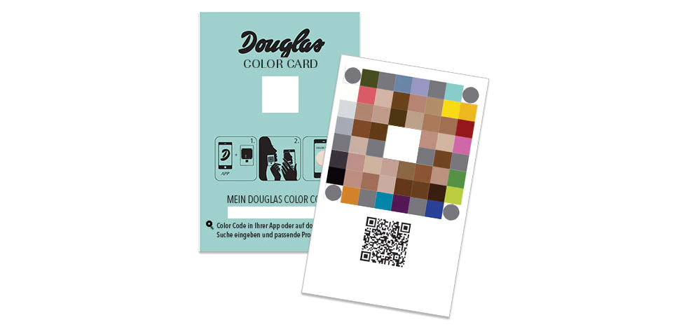
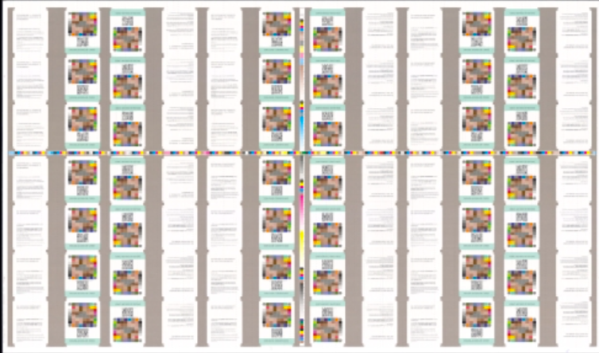

```{r setup, include=FALSE}
knitr::opts_chunk$set(echo = TRUE, fig.align = "center")
```
 
## 1 Introduction

### 1.1 The Data

```{r, include=FALSE}
# Load data
master <- read.csv2("MasterColorCard.csv")
lab <- read.csv2("LabMeasurements-Color-Card.csv")
```

The following report is based on two given data files both in csv format. They generally contain color code measurements of the Douglas Color Cards (DCC). The DCC are used in combination with a mobile App. The consumer takes a photo holding the DCC close to their face. With the help of the app, the correct foundation nuance is recommended based on the skin color results.




**The first data file** (MasterColorCard.csv) contains the "perfect" DCC as it should always be with color codes in CMYK and Lab space. The resulting dataframe from the csv file consists of 64 rows (each color spot is represented as one row) and 11 columns.

```{r}
dim(master)
```

```{r}
names(master)
```

Each of the 64 color spots on the master DCC has a specific position, that is described in columns Crow and Ccol.

**The second data file** (LabMeasurements-Color-Card.csv) is larger than the first data set because it contains several color spot measurements from multiple color cards which have been printed on 13 print sheets.
Put into a dataframe, the data is clearly in wide format which means that the color spots are not depicted in rows but rather obtain three columns (L-a-b).

```{r}
dim(lab)
```

The dimensions are 546 row and 194 columns which can be explained with the following calculations:

**13** printing sheets **x 42** color cards on each printing sheet **= 546** rows

**3** L-a-b color values **x 64** color spots on each DCC **+ 2** rows for indexing **= 194** columns

In conclusion, each row in this dataframe depicts one complete DCC which has been measured in the lab. 
The file also contains the position on the printing sheet as in row and column. Therefore every row/column combinations exists 13 times. 

### 1.2 The Task
The task is to make sense out of the given data sets and explore what conclusions can be drawn. The objective is to use a variety of calculations and visualization techniques to find those explanations for the given data.

### 1.3 The Tools
In the process of the group work, we have been using Github and R Studio. With Github we were able to share our R scripts in an anonymized manner. R Studio has been the choice of our local working environment due to the fact that all lectures have been complemented with R Studio. Hence the environment was known to each team member. 

### 1.4 What We Expect
Upon first looks into the data, we expect to find DCCs from the lab that vary a lot from the Master DCC in color space given in L-a-b values. We will explore these differences using multiple visualization techniques that have been subject in current lectures including Data Visualization and Machine Learning.

<a href="#top">Back to top</a>

## 2 Data Exploration and Findings

To have a first overview of the master DCC data, a 3-dimensional scatterplot was created. The following code produces one in the L-a-b space with each spot represented in the respective color on the master DCC.

```{r, include=FALSE}
# Libraries to be used in this code
library("scatterplot3d") # load
library(colorspace) # load
```

```{r}
# save L, a and b values from dataframe to vectors
Lstar = master$L
Astar = master$a
Bstar = master$b

# create new dataframe from L-a-b vectors
solarized = structure(list(Lstar, Astar, Bstar), .Names = c("Lstar", "Astar", "Bstar"), row.names = c(NA,16), class = "data.frame")
solarizedLAB = with(solarized, LAB(Lstar, Astar, Bstar))

# show us all 64 color spots in a L-a-b plot coloured in their LAB color
s3d <- scatterplot3d(master[,9:11], 
              main="Master Color Card - Lab values",
              color = hex(solarizedLAB, fixup = TRUE),
              pch = 16, 
              type = "h",
              grid=TRUE,
              box=FALSE)
```

### 2.1 K-Means Clustering
After an initial feeling for the master DCC, one way to visually access the lab data is to cluster each of the 546 DCC.

```{r, include=FALSE}
library(factoextra)
```

In order to 
```{r}
# function will determine best k via elbow method
fviz_nbclust(lab, kmeans, method = "wss")
```

The elbow is visible at "Number of clusters k"  = 3, where the Sum of Squares falls rapidly for the last time. Hence we will choose the K-means clustering with 3 clusters and plot them for the first two principal components.

```{r}
# Run a K-means clustering with 3 clusters and plot the clusters for first 2 principal components
km.out<-kmeans(lab,centers=3,nstart=1) #run with four clusters
pr.out<-prcomp(lab,scale=TRUE)
plot(pr.out$x[,1:2],type="n", main="546 Clustered Color Cards", ylab="PC2")
text(pr.out$x[,1:2],col=km.out$cluster)
```

### 2.2 MDS
The main goal of MDS it is to plot multivariate data points in two dimensions, thus revealing the structure of the dataset by visualizing the relative distance of the observations.

```{r}
# Plot the master card's color spots with their field number labels into a 2D space
master <- as.matrix(master)[, 9:11]
mds <- cmdscale(dist(master))

# Plot the labs means of all color spots with their field number labels into a 2D space
# calculate the lab measurements means
mlab <- colMeans(x = lab)
mlab <- as.matrix(mlab)[3:194]
mlab <- t(mlab)
mlab <- as.data.frame(matrix(unlist(mlab, use.names=FALSE),ncol=3, byrow=TRUE))
colnames(mlab) <- c("L", "a", "b")
mlab <- as.matrix(mlab)
mds.ml <- cmdscale(dist(mlab))

# Plot both (master and mean lab results) into one space
plot(mds.ml, type = 'n', main="Master and mean lab DCC results compared", xlab="MDS 1", ylab="MDS 2")
text(mds[, 1], mds[, 2], cex=0.8) # master
text(mds.ml[, 1], mds.ml[, 2], col="red", cex=0.8) # lab means
legend(x = 40 , y = 51,
       legend = c("Master", "Mean Lab Results"), 
       fill = c("black", "red"), 
       bty = "n", 
       cex = 0.8)

# add connecting lines into plot
segments(mds[, 1], mds[, 2], mds.ml[, 1], mds.ml[, 2] ,col = par("fg"), lty = par("lty"), lwd = par("lwd"))
```

The MDS plot visualizes the master data points (black) values in a 2d plot and their distance to the mean of all color spots from the lab results (red). The position of the numbers in the plot is derived from their L-a-b color spot values. The numbers in the plot are the respective color spot with labels from 1 to 64.
One can see from this plot that there are lab result color spots that are more different than the actual master color spot L-a-b color value. Visibly different are color spots 8 with the visually greatest distance from the master color spot as well as 61 and 63.
It makes sense to have a closer look into this difference on a detailed level (and not on the "mean over all lab results" scale) which is what we are doing in the following visualisations.

### 2.3 CIE76

The CIE76 deltaE was used in order to obtain an easy-to-calculate color measurement; the Euclidian distance is used for determining color distance.

using: 
$$ ({L_{1}^{*}},{a_{1}^{*}},{b_{1}^{*}})$$ and  $$({L_{2}^{*}},{a_{2}^{*}},{b_{2}^{*}}),$$ 
two colors in L-a-b:

$$
\Delta E_{ab}^{*}={\sqrt {(L_{2}^{*}-L_{1}^{*})^{2}+(a_{2}^{*}-a_{1}^{*})^{2}+(b_{2}^{*}-b_{1}^{*})^{2}}}
$$
```{r, include=FALSE}
# Load data
master <- read.csv2("MasterColorCard.csv")
lab <- read.csv2("LabMeasurements-Color-Card.csv")
```
```{r compute CIE76}
deltae <- matrix(NA,nrow = 546, ncol=66, byrow = TRUE)
deltae[,1] <- lab[,1]; 
deltae[,2] <- lab[,2]; 

# colnames(deltae)
colnames(deltae) <- c("Row", "Column", c(11:18, 21:28, 31:38, 41:48, 51:58, 61:68, 71:78, 81:88))

distance_single <- {}
distance_row <- {}


for (i in 1:length(row.names(lab))) {
    cardmatrix <- matrix(lab[i,-c(1:2)],nrow=64,ncol=3,byrow=TRUE)
    colnames(cardmatrix) = c("L","a","b")
    for (j in 1:64) {
        cardmatrix[j,] -> matrixA
        master[j,] -> matrixB
        distance_single <- sqrt((matrixA$L - matrixB$L)^2 + (matrixA$a - matrixB$a)^2 + (matrixA$b - matrixB$b)^2)
        distance_row[j] <- distance_single
    }
    deltae[i,-c(1:2)] <- distance_row
}
```

The following histogram shows the frequency of all eucledean distances between each master DCC color spot and each corresponding lab result color spot. 

```{r plot CIE76}
hist(deltae, #breaks = 20, 
     xlim = range(0:40),#c(0,40), 
     main = paste("Histogram of" , 'CIE76', "of Master"),
     ylim = NULL,
     xlab = 'Euclidean Distance', ylab = 'Frequency', col = 'lightblue',
     #axes = FALSE, 
     plot = TRUE, labels = FALSE)
```

The results data concerning CIE76 euclidean distance is still distinguishable to the human eye under controlled viewing conditions. The $$\Delta E_{ab}^{*}\approx 2.3$$ corresponds to the just noticeable difference (JND). The metric here varies between 0.05 units and 36.44 units.
One can see from the histogram above that most eucledian distances are below the JND. A few euclidean distances even reach above 30 which means that the colors differ a lot between the master DCC color spot and the mean of the respective lab result color spots. 

Since the JND starts at a euclidean distance of 2.3, we want to visualize the count of lab result DCC color spots that are greater than the JND:

```{r}
# Just noticeable difference starts at deltae 2.3
# Add column to deltae data frame which counts the cells rowwise which are above the threshold
deltae.copy <- as.data.frame(cbind(deltae))
deltae.copy$JDNcount <- rowSums(deltae.copy[,3:66] >= 2.3)
# Which counts are the most common among all color cards
boxplot(deltae.copy$JDNcount, main="Count of visibly different color spots of all lab result DCC", ylab="JDN Count")
```

Interestingly, every single DCC from the lab results has at least 25 color spots that are visibly different from the master DCC color spots. The mean is at 35 and there exist at least one lab result DCC in which 50 (out of 64) color spots differ visibly from the master.

In the box plot we can deduce two things, the first is that most of the deltaE values per pixel are uniformly distributed, we see this in the box plots that have a symmetrical shape, meaning that the data are equally distributed on the mean, and we also find only a few outliers.

Another interesting point is to look at the y-axis, the deltaE values where the box plots are located, here we see that most of them are near a delta E 2. This delta E is the JND measure we use to define if one color is different from another in this analysis and as the majority of deltaE pixels are close to this value, it is a good indicator of the print quality of each pixel. It is important to recall that this delta E shown on the box plot is the average delta E of that pixel on all 546 cards.

We now want to compare all lab result DCC color spots side by side to see which exact color spots have the highest euclidean distance and vary the most.

```{r}
# all color spots deltaes as boxplot next to each other
boxplot(deltae.copy[3:66], main="Euclidean distances of all lab result DCC color spots side-by-side", xlab="Row/Column position of color spot", ylab="Euclidean Distance")
```

From this comparison, we can easily see that the color spots in all 13 printing sheets at position 32 are extremely off with a delta e above 30. The color spots at position 85 and 34 follow with a delta e of about 10.

Depicted in a 8x8 heatmap that contains all 64 color spots, we can now see which color spots exactly differ the most between master and lab results.

```{r image code}
deltae -> CIE76
means_colors <- apply(CIE76[,3:66],2,mean)

means_colors_sorted <- {}
for (i in c(1:64)) {
  colorMean <- means_colors[i] 
  if (colorMean < 1) # Unnoticable to the human eye
    means_colors_sorted[i] = 1 
  else if (colorMean > 1 && colorMean < 2) # barely noticable
    means_colors_sorted[i] = 2
  else if (colorMean > 2 && colorMean < 4) # noticable difference on a keen eye
    means_colors_sorted[i] = 3
  else if (colorMean > 4 && colorMean < 10) # # distinguishable
    means_colors_sorted[i] = 4
  else if (colorMean > 10) # # clearly distinct
    means_colors_sorted[i] = 5
  else if (colorMean > 33) # # clearly distinct
    means_colors_sorted[i] = 6
}
#means_colors_sorted
mean_matrix <- matrix(-means_colors_sorted, nrow = 8, ncol= 8, byrow = TRUE, dimnames = NULL)

```

```{r heatmap, include=FALSE}
# heatmap with col = heatmap()
mean_heatmap <- heatmap(mean_matrix, Rowv=NA, Colv=NA, col = heat.colors(5, alpha=1), 
                       scale="column", margins=c(5,10))
```

```{r image plot, fig.height = 6.2, fig.width = 6.5}
image(t(mean_matrix),axes=FALSE,col = heat.colors(5), main="Heatmap of euclidean distances of averaged color spots")
axis(side=2, at=seq(from=0,to=1,length.out=8),labels=c(1:8), cex = 0.5)
axis(side=1, at=seq(from=0,to=1,length.out=8),labels=c(1:8), cex = 0.5)

```
This heatmap shows us with an intense red color the pixels (average of the deltaE pixel in the 546 cards) that are clearly different to the master card. Only two pixels are. The other pixels are considered slightly different or not different from the master card. This is a good indication that the printing of the cards does not alter the printed colors significantly.

### 2.4 JND: Applied to "Target Card"

42 DCC are printed on each sheet with 7 rows and 6 columns of cards as seen in the picture below. 
A QR code on each DCC identifies its position on the large sheet (row numbers from 1 to 7, column numbers from 1 to 6), which is also called a target.



The objective is to compare the 13 target cards that are in a certain position on the printing sheet, and see how they behave in relation to the master card. Then we filter the delta e with the JND scale and count how many color spots are similar to the master and how many are very different from the master card. The results are found in the barplots below. 

```{r comparison per sheet position code, echo= FALSE}
# create a new matrix where we sum each 13 cards according to it position in the sheet
card_positions <- matrix(NA, nrow = 42, ncol=64, 
                         byrow = FALSE, dimnames = NULL)
k <- 1
x <- CIE76[,-c(1:2)]
for (i in 1:42) {
  card_positions[i,] = apply(x[c(k:(k+12)),],2,mean)
  #print(i)
  k = k+13
}
```
The colors are the same as those used in the previous heatmap, according to its delta e, color spots are assigned to a categorical variable such as: "Clearly distinct", "Distinguishable", "Noticable difference on a keen eye", "Barely noticable", "Unnoticable to the human eye", as displayed in the legend below.
```{r labels plot, fig.height = 3.5, fig.width = 4.5}
plot.new()
legend("center", title="Color Scale", col= par("col"),
       legend = c( "Clearly distinct","Distinguishable", "Noticable difference on a keen eye",
                   "Barely noticable", "Unnoticable to the human eye"),
       fill = heat.colors(5,alpha=1) )
```

```{r comparison per sheet position plot}

#par("mar")
par(mar=c(1,1,1,1))
par(mfrow=c(7,6))
mean_cards <- {}
for (i in c(1:42)) {
  colorMean <- card_positions[i,]
  for (j in c(1:64)) {
    if (colorMean[j] < 1) # Unnoticable to the human eye
      mean_cards[j] = 1 
    else if (colorMean[j] > 1 && colorMean[j] < 2) # barely noticable
      mean_cards[j] = 2
    else if (colorMean[j] > 2 && colorMean[j] < 4) # noticable difference on a keen eye
      mean_cards[j] = 3
    else if (colorMean[j] > 4 && colorMean[j] < 10) # # distinguishable
      mean_cards[j] = 4
    else if (colorMean[j] > 10) # # clearly distinct
    mean_cards[j] = 5
  }
  barplot(table(mean_cards), col = c("#FFFF80FF", "#FFFF00FF", "#FFAA00FF", "#FF5500FF", "#FF0000FF"),main="", names.arg="")
}
```

### 2.5 CIE94

The CIE94 deltaE was used in order to obtain a more advanced mesasurement on the differences among colors. CIE94 was introduced in 1994 as an extension to the formerly established CIE76. It's basic structure is similar to CIE76 in that it uses the Euclidean Distance, though it includes additional weighting factors to account for application specific differences in perception. According to Wikipedia: "[CIE94] addresses perceptual non-uniformities, while retaining the L*a*b* color space, by the introduction of application-specific weights derived from an automotive paint test's tolerance data."

$$ ({L_{1}^{*}},{a_{1}^{*}},{b_{1}^{*}})$$ and  
$$({L_{2}^{*}},{a_{2}^{*}},{b_{2}^{*}}),$$ 
two colors in L-a-b:

$$
\Delta E_{94}^{*}={\sqrt {(\frac{\Delta L^{*}}{k_{L}S_{L}})^{2}+(\frac{\Delta C_{ab}^{*}}{k_{C}S_{C}})^{2}+(\frac{\Delta H_{ab}^{*}}{k_{H}S_{H}})^{2}}}
$$
In detail, the equation consists of the following sub-operations: 
$$
\Delta L^{*} = L_1^{*} - L_2^{*}\\
C_1^* = {\sqrt {a_1^{*2} + b_1^{*2}}}\\
C_2^* = {\sqrt {a_2^{*2} + b_2^{*2}}}\\
\Delta C_{ab}^{*} = C_1^* - C_2^*\\
\Delta H_{ab}^* = {\sqrt {{{\Delta E_{ab}^{*}}^2} - {\Delta L^*}^2 - {{\Delta C_{ab}^{*}}^2}}} = {\sqrt {{{\Delta a^{*}}^2} + {\Delta b^*}^2 - {{\Delta C_{ab}^{*}}^2}}}\\
\Delta a^* = a_1^* - a_2^*\\
\Delta b^* = b_1^* - b_2^*\\
S_L = 1\\
S_C = 1 + K_1C_1^*\\
S_H = 1 + K_2C_1^*\\
k_L = 1\\
K_1 = 0.045; K_2 = 0.015
$$

The matrix consisting of the differences between every single one of the pixels from the printed cards versus the master color data resulted in a similar outcome as the CIE76 comparison provided, as we present in 2.6.

```{r load data, echo=FALSE}
# Load data
lab.measure <- read.csv2("LabMeasurements-Color-Card.csv")
master.color <- read.csv2("MasterColorCard.csv")
```
```{r compute CIE94 function}
# function to compute the distances based on Lab1 and Lab2
labDistance <- function(L1,a1,b1,L2,a2,b2) {
  # collection of all values from CIE94
  dL <- L1 - L2
  C1 <- sqrt((a1)^2 + (b1)^2)
  C2 <- sqrt((a2)^2 + (b2)^2)
  dC <- C1-C2
  da <- a1 - a2
  db <- b1 - b2
  dH <- sqrt(da^2 + db^2 - dC^2)
  Sl <- 1
  kL <- 1
  K1 <- 0.045
  K2 <- 0.015
  Sc <- 1 + K1*C1
  Sh <- 1 + K2*C1
  
  # final distance value
  dE <- sqrt((dL/(kL * Sl))^2 + (dC/Sc)^2 + (dH/Sh)^2)
  return(dE)
}
```
``` {r instantiation, echo=FALSE}
# instantiate the iterators and the dataframe to store the values in
lab.distances <- as.data.frame(matrix(c(1:3),nrow = 1))
k <- 1
l <- 1
i <- 1
# choose the amount of sheets to scan through (max=13), max will take ~5 sec
sheets <- 13

# iterate through cards
for (m in c(1:(sheets*42))){
  # iterate through pixel
  for (j in c(3:dim(lab.measure)[2])){
    # if iterator is not dividable by 3, jump to the next j i.e. jumping over the Lab sequences
    if (j%%3 != 0){
      
    }else{
      
      if (i > 64){
        i <- 1
      }
      
      # in the storage dataframe, jump to the next row for the next card if k > 64
      if (k < 65){
        lab.distances[l,k + 2] <- labDistance(master.color[i,9], master.color[i,10],master.color[i,11],lab.measure[m,j],lab.measure[m,j+1], lab.measure[m,j+2])
        k <- k + 1
      }else{
        # adding row label from lab.measure file
        lab.distances[l, 1] <- lab.measure[l, 1]
        lab.distances[l, 2] <- lab.measure[l, 2]
        l <- l +1
        lab.distances[l, 3] <- labDistance(master.color[i,9], master.color[i,10],master.color[i,11],lab.measure[m,j],lab.measure[m,j+1], lab.measure[m,j+2])
        k <- 2
      }
      #print(i) #to check that everything is running smooth
      i <- i + 1
    }
  }
  # adding the labels for the two very last rows
  lab.distances[l, 1] <- lab.measure[l, 1]
  lab.distances[l, 2] <- lab.measure[l, 2]
}
colnames(lab.distances)<- c("Row", "Column", c(11:18, 21:28, 31:38, 41:48, 51:58, 61:68, 71:78, 81:88))
CIE94 <- lab.distances

```

### 2.6 Comparing CIE76 vs CIE94

The histogram of the distances for each color shows some outliers, though the majority of color dots is very close to the master color data. The histogram looks similar to the CIE76 plot, though one can observe that the histogram is shifted slightly to the right, indicating that the CIE76 differences might measure larger differences than the CIE94 method. 

```{r echo=FALSE}
par(mfrow=c(1,2))
hist(as.matrix(lab.distances[3:66]), xlim=c(0,40),
     breaks = 20, 
     main="Histogram of CIE94",
     ylim = c(0,20000),
     xlab="Distance to Master Color")
hist(deltae, breaks = 20, xlim = c(0,40), 
     main = "Histogram of CIE76",
     ylim = c(0,20000),
     xlab = 'Distance to Master Color')

```

By plotting the average differences of the distance values comparing the mean results of CIE76 vs CIE94 as a histogram, it is to be concluded that there is only a marginal difference between the two methods.The largest measured difference is no nearly 6 units. The majority of differences is below the JND.

```{r comparing CIE76 vs CIE94 statistically}
# compare dimensions
# dim(CIE76); dim(CIE94)

# subtract the deltaes of CIE94 off the deltaes of CIE76 to analyse the differences between both equations (dd, the double d stands for double deltae!)
dd <- CIE76[,3:66] - CIE94[,3:66]
# calculate means of the double deltae and the total mean of everything
dd.means <- apply(dd, 2, mean)
dd.mean <- mean(dd.means)
dd.max <- max(dd)

# do the same to the original two dataframes
# CIE76
CIE76.means <- apply(CIE76[,3:66], 2, mean)
CIE76.mean <- mean(CIE76.means)
CIE76.max <- max(CIE76[,3:66])

# CIE94
CIE94.means <- apply(CIE94[,3:66], 2, mean)
CIE94.mean <- mean(CIE94.means)
CIE94.max <- max(CIE94[,3:66])

# plot histograms of CIE76, CIE94 data and the double d in same scale for comparison
hist(dd.means, breaks = 5, xlim = c(0,10), xlab="Average difference CIE76 vs CIE94", main="Histogram of Difference between CIE94 and CIE76")
```

Comparing the mean results of CIE76 and CIE94 in a scatterplot reveals that in general the measured distances appear larger in CIE76 versus CIE94. Not a single color has been measured with a larger difference on average with CIE94 than it was calculated with CIE76, as the line represents the unity vector through the origin. 

```{r scatterplot}
# plotting means of cIE94 against CIE76
par(mfrow=c(1,1))
plot(CIE76.means ~ CIE94.means, type="n", main="CIE94 Means vs CIE76 Means", xlab="Means of CIE94",ylab="Means of CIE76")
# add line for comparing level of identity
abline(a=0, b=1)
text(CIE94.means, CIE76.means, labels=colnames(CIE94[3:66]))
```

Finally, CIE94 provides a more accurate estimation of the perceived color difference as it also takes into account parameters such as lightness, chroma and hue value. However, due to the complexity of its calculation, it requires more computing time. Additionally, as we are not dealing with complex pictures (i.e. high resolution pictures with various levels of saturation and lightness), the choice of whether to use CIE76 or CIE94 is not a very relevant one. Both methods yield statistically speaking similar results (i.e. p-value > 0.05):

```{r}
t.test(CIE94.means,CIE76.means)
```

### 2.7 Master Pixels against the Largest Distance Pixels

In order to "see" the scope of differences among the pixels in the color cards, we identify the pixels of each of the 64 colors of the 546 cards with the largest difference to the respective pixel in the master card. First, we visually show the distances between each pixel pair with a 3D scatterplot, depicting the Lab values of the master color card and the card with largest distance pixels. 
```{r}
# attach sheet numbers to distance deltae data frame
sheet.number <- {}
k <- 1
for (i in 1:546) {
  if (k>13) {
    k <- 1
  }
  sheet.number[i] <- k
  k <- k +1
}
CIE94 <- cbind(sheet.number, CIE94)

# identify cell with the largest distance between lab and master color
#CIE94[which.max(apply(CIE94,1,max)), which.max(apply(CIE94,2,max))]
# extract row and column values
max.color <- c(which.max(apply(CIE94,1,max)), which.max(apply(CIE94,2,max)))
# extract column name i.e. color card pixel position
pixel.number <- colnames(CIE94[max.color[2]])
# extract sheet number
sheet.number <- CIE94[max.color[1], 1]
# build column name, e.g. "L12", "a42"
col1 <- paste(c("L", pixel.number), collapse = "")
col2 <- paste(c("a", pixel.number), collapse = "")
col3 <- paste(c("b", pixel.number), collapse = "")
# collect Lab value
Lab <- c(lab.measure[max.color[1],col1], lab.measure[max.color[1],col2], lab.measure[max.color[1],col3])
# transform Lab value to hexadecimal color
lab.hex <- hex(LAB(Lab[1],Lab[2],Lab[3]), fixup = T)
# create hexadecimal color of master card
master.hex <- hex(LAB(master.color[which(master.color$Crow == 3 & master.color$Ccol == 2), "L"],master.color[which(master.color$Crow == 3 & master.color$Ccol == 2), "a"],master.color[which(master.color$Crow == 3 & master.color$Ccol == 2), "b"]), fixup=T)

allMax <- matrix(NA,nrow = 64, ncol=3, byrow = TRUE)
for (i in 4:67) {
  allMax[i-3, 1] <- which.max(CIE94[,i])
  allMax[i-3, 2] <- i-3
  allMax[i-3, 3] <- max(CIE94[,i])

}

# function to display a color card. Expects a distance matrix of 64:2, 
# with rowvalue being the row value of CIE94 and column value being the column value of CIE94 (as in 3~13,64~88)
Lab.vector <- matrix(NA,nrow=64,ncol=3)
max.card <- function(pixels){
  pixel.numbers <- matrix(NA, nrow=64, ncol=1, byrow=TRUE)
  for (i in 1:64){
    pixel.numbers[i,1] <- colnames(CIE94[pixels[i, 2]+3])
  }
  pixels <- cbind(pixels, pixel.numbers)
  for (i in 1:64){
    col1 <- paste(c("L", pixels[i,4]), collapse = "")
    col2 <- paste(c("a", pixels[i,4]), collapse = "")
    col3 <- paste(c("b", pixels[i,4]), collapse = "")
    Lab <- c(lab.measure[pixels[i,1],col1],
             lab.measure[pixels[i,1],col2],
             lab.measure[pixels[i,1],col3])
    Lab.vector[i,1] <- Lab[1]
    Lab.vector[i,2] <- Lab[2]
    Lab.vector[i,3] <- Lab[3]
  }
  return(Lab.vector)
}

colorcardDisplay <- function(pixels){
  pixel.numbers <- matrix(NA, nrow=64, ncol=1, byrow=TRUE)
  for (i in 1:64){
    pixel.numbers[i,1] <- colnames(CIE94[pixels[i, 2]+3])
  }
  pixels <- cbind(pixels, pixel.numbers)

  pixel.hex <- matrix(NA, nrow=64, ncol=2, byrow=T)
  for (i in 1:64){
    col1 <- paste(c("L", pixels[i,4]), collapse = "")
    col2 <- paste(c("a", pixels[i,4]), collapse = "")
    col3 <- paste(c("b", pixels[i,4]), collapse = "")
    Lab <- c(lab.measure[pixels[i,1],col1],
             lab.measure[pixels[i,1],col2],
             lab.measure[pixels[i,1],col3])
    lab.hex <- hex(LAB(Lab[1],Lab[2],Lab[3]), fixup = T)
    pixel.hex[i,1] <- pixels[i,3]
    pixel.hex[i,2] <- lab.hex
  }
  image(matrix(1:64,nrow=8),col=pixel.hex[,2],main="Maximum Distances Card",xlab="",ylab="", axes= FALSE)
  axis(side=1, at=seq(from=0,to=1,length.out=8),labels=c(1:8))
  axis(side=2, at=seq(from=0,to=1,length.out=8),labels=c(1:8))
}

# function to create scatterplot3ds comparing master colors against 1 lab card
Lab.spl <- function(master, lab) {
  spl <- scatterplot3d(master, 
                       main="Master Color Card - Lab values",
                       #color = hex(solarLAB(master[,1],master[,2],master[,3]), fixup = TRUE),
                       color = "red",
                       pch = 16, 
                       type = "h",
                       grid=TRUE,
                       box=FALSE)
  spl$points3d(lab,
               #col = hex(solarLAB(lab[,1],lab[,2],lab[,3]), fixup = TRUE),
               col = "blue",
               pch = 15,
               type = "h")
  legend(spl$xyz.convert(20, 10, 70), 
         col= c("red","blue"), 
         bg="white", 
         lty=c(1,1), lwd=2, yjust=0, 
         legend = c("Master","Lab"), cex = 1.1)
  text(spl$xyz.convert(master), 
       labels = rownames(master),
       cex= 0.7, 
       #col = hex(solarizedLAB, fixup = TRUE),
       pos = 3) 
  segments(spl$xyz.convert(master)$x,spl$xyz.convert(master)$y,
           spl$xyz.convert(lab)$x,spl$xyz.convert(lab)$y,
           lwd=2,col=1)
}

Lab.spl(master.color[,9:11],max.card(allMax))
```
We then reproduce a "card of maximum distances" and compare it against the original master card. The colors have been transformed from Lab values to their respective hexadecimal values to plot them in R. We can clearly see in the graph below, that pixel 32 (row=3, colum=2) is very different from the intended color. The other major distinguishable difference as indicated by the heatmap can be found at pixel 85, the violet spot at the top center. 
```{r fig.height = 5, fig.width = 8, fig.align = "center"}
# function to display the master color card. No inputs expected
mastercardDisplay <- function(){
  master.hex <- matrix(NA,nrow=64,ncol = 1,byrow=T)
  for(i in 1:64){
    master.hex[i,1] <- hex(LAB(master.color[i, "L"],master.color[i, "a"],master.color[i, "b"]), fixup=T)
  }
  image(matrix(1:64,nrow=8),col=master.hex[,1],main="Master Color Card",
        xlab="",ylab="", axes= FALSE)
  axis(side=1, at=seq(from=0,to=1,length.out=8),labels=c(1:8))
  axis(side=2, at=seq(from=0,to=1,length.out=8),labels=c(1:8))
}
par(mfrow=c(1,2))
colorcardDisplay(allMax)
mastercardDisplay()
```

<a href="#top">Back to top</a>

## 3 Conclusion

Something like:  Whether or not the printer quality is bad depends on the sensitivitiy of the app-algorithm. If a Lab distance of >30 can be tolerated, then the printing quality is fine, otherwise, this would lead to errors when using the app.

# some conclusions from tata

After comparing the measurements of the sheets of paper with the measurements of the master card we came to the conclusion that changes in the printing and the position of the card on the sheet of paper influence the quality and accuracy of the desired color (i.e. the master card), however most of these differences are not visible to the human eye and therefore are not perceptible and do not affect the printing result.

In the same way, each color card has a bar code that indicates in which part of the sheet this card was printed, in our analysis we found that there are differences in the printed colors depending on the place where the card was printed, these results are seen in the JND barplots per sheet.

although we see a difference in the number of colors that are visibly different to the human eye, we can see that in all pocisisons the number of colors that are extremely different remains the same (red bars). this indicates that changes in pixel colors vary slightly between positions and do not affect the reading of the app to any small degree.

out of the 64 pixels of the card one color is extremely different compared to the master card, the pixel corresponds to the position in the (3,2). this pixel matches the light grey colour, is the lightest colour on the grey scale of the colour chart and has an average deltaE distance of 35 units. Despite this long deltaE distance the color cards are used indicating that this color does not affect the final pre-determined app color.

It seems that the app can calibrate the color cards according to their original position on the sheet of paper, and so perform the skin color predictions without errors.

An additional analysis for the future would be to check whether the differences observed using deltaE and the JND scale are statistically significant and thus determine whether the printed color chart is in fact different from the master chart.

<a href="#top">Back to top</a>
